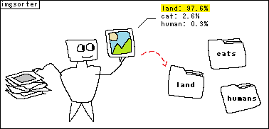

## imgsort
> Command-line utility to build an image classification model out of organised image folders and then sort random images into those subsubfolders.



### About

- Uses state of the art [EfficientNet-Lite](https://blog.tensorflow.org/2020/03/higher-accuracy-on-vision-models-with-efficientnet-lite.html), released in March 2020. It is a smaller, newer version of EfficientNet made to run on lower end hardware while still outperforming Inception V4 (using the B4 model size).
- Fun little project made in about 3 days

### Installation

```bash
$ git clone <this repo>
$ cd imgsort
$ python3 -m venv . # Create a virtual environnement, highy recommended unless you want 1.5gb of libraries in your global environment.
$ ./Scripts/Activate.ps1 # Or activate.sh on bash/linux environements.
(imgsort) $ python3 -m pip install -r requirements
(imgsort) $ python3 ./src/app.py -h
```

Docker image soon.

### Usage

Prepare a folder with subfolder and images inside of those repesenting the name of the subfolder:

```
C:\Documents\Pictures\My Sorted Pictures
├───cats
│       cat_1.png
│       cat_2.png
│       ...
├───dogs
│       dog_1.png
│       dog_2.png
│       ...
└───humans
        human_1.png
        human_2.jpg
        ...
```

Train the model:

```bash
imgsort train "C:\Documents\Pictures\My Sorted Pictures" "C:\Documents\Imgsort Model" -n 3
```

Before sorting:

```
C:\Documents\Downloads
│        file (1).png
│        file (2).jpg
│        file (3).png
│        file (4).jpg
│        file (5).jpg
│        ...
├───cats
├───dogs
└───humans
```

Sort images in a folder 

```bash
imgsort sort "C:\Documents\Downloads" "C:\Documents\Imgsort Model"
```

After sorting:

```
C:\Documents\Downloads
├───cats
│        file (2).jpg
│        file (4).jpg
│        file (1).png
│        ...
├───dogs
│        file (5).jpg
│        ...
└───humans
         file (3).png
         ...
```

### Options

#### Training options

- `-e [integer]` or `--epochs [integer]` the number of training epochs to perform, value should ideally sit between 2 and 6
- `-n` (required) number of categories (subfolders)

#### Sorting options

- `-t [integer]` or `--threshold [integer]` only moves images only if a category is greater than threshold

### Known Issues
- Doesn't use the batch feature from TensorFlow for sorting, doesn't multithread sorting.
- Not optimised at all for TPUs/GPUs, only runs on CPU, look into CUDA or mROC tensorflow installs if needed.
- Will only work with `png`, `jpg`, and `gif` (first frame) images. `jpeg` files ignored.
- Expects empty subfolders with the names of the categories in the unsorted folder.
- 1.5gb of dependencies are pulled (won't fix)
- no `setup.py`